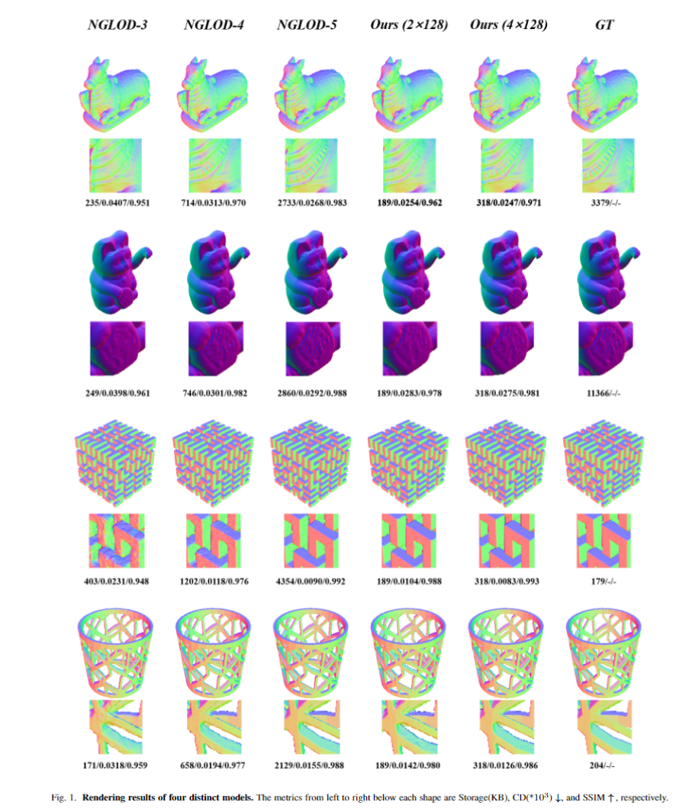
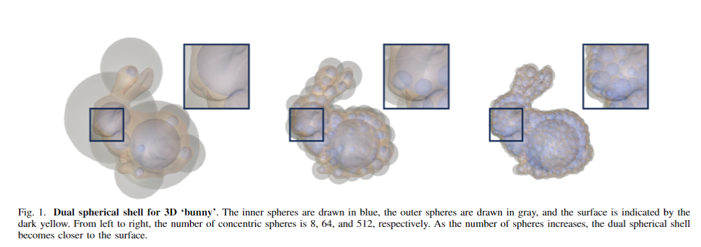
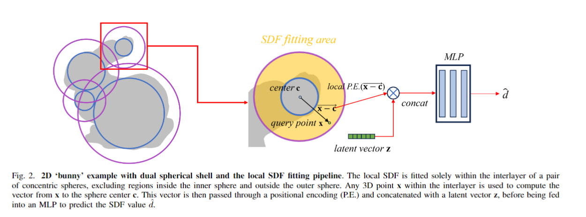
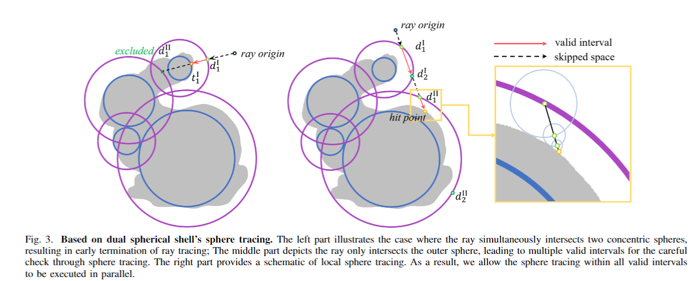
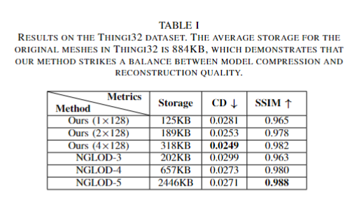
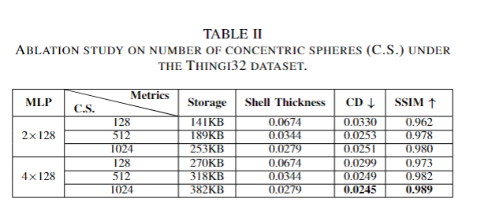
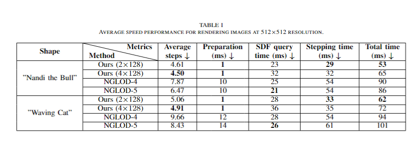
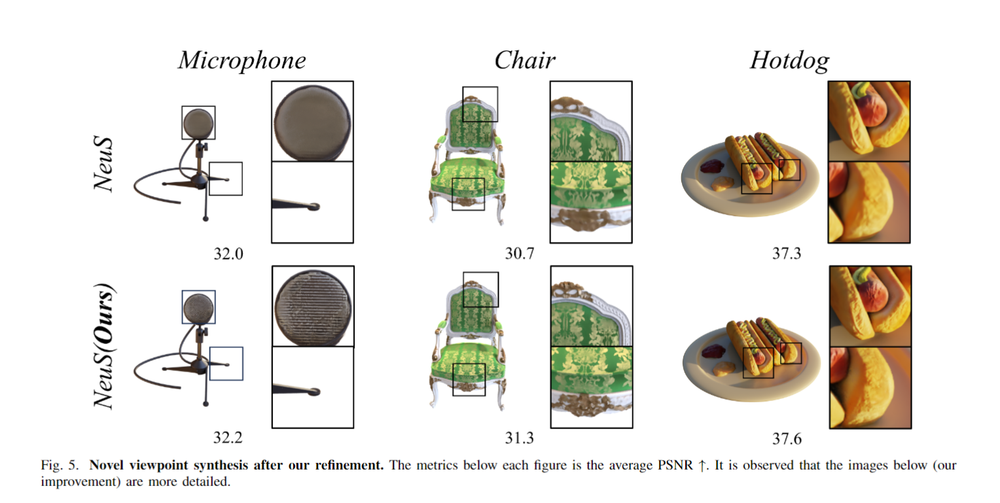
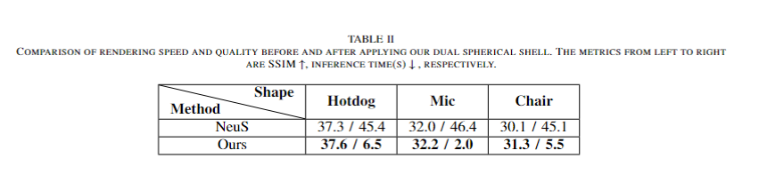

# Neural Implicit Reconstruction and Fast Rendering Based on Dual Spherical Shell

## Methodology
We introduce a novel dual spherical shell representation that facilitates accurate reconstruction while keeping low storage demands.By leveraging a Multi-Layer Perceptron (MLP) to overfit the SDF in the interlayer of concentric spheres, we enable the compression and reconstruction of models utilizing neural SDF. Additionally, our  approach enhances the rendering efficiency by capitalizing on the intrinsic properties of spherical shell, which allows for a departure from the traditional sequential sphere tracing method along each ray. Four shapes are shown below. Compared to the previous works[1], our method achieves the high-fidelity and high-compression coding and reconstruction for most of 3D objects in the test dataset.


As shown below, our dual spherical shell effectively encloses the surface with an interlayer. As the number of spheres increases, the thickness of the spherical shell gradually decreases.

[1] Towaki Takikawa, Joey Litalien, Kangxue Yin, Karsten Kreis, Charles Loop, Derek Nowrouzezahrai, Alec Jacobson, Morgan McGuire, and Sanja Fidler, “Neural geometric level of detail: real-time rendering with implicit 3d shapes,” in CVPR, 2021.

## Network
The dual spherical shell effectively constrains the upper and lower bounds of the SDF values, which helps to reduce the fitting difficulty. We assign an implicit vector to each sphere center to participate in the fitting, as shown in the figure below. The 3D vector between the fitting point and the sphere center is position-encoded and then concatenated with the implicit vector associated with the sphere center. This concatenated input is fed into an MLP, which ultimately outputs the predicted SDF value.


## Rendering
As shown in the figure below, during rendering, we utilize the dual spherical shell to eliminate unnecessary sphere tracing components and also exclude spaces that are not enclosed by the spherical shell.


## Experiment






## Dataset
We use Thingi10k and NeRF synthetic datasets, both of which are available from their official website.
### Thingi10k
You can download them at https://ten-thousand-models.appspot.com/
### NeRF synthetic
https://drive.google.com/drive/folders/128yBriW1IG_3NJ5Rp7APSTZsJqdJdfc1

## Getting started
### Python dependencies
```
conda env create -f environment.yml
conda activate kaolin_test
cd ./submodules/miniball
python setup.py install
cd ..
cd ./kaolin_sphere-0.9.1
python setup.py develop
```

### Training
```
python train.py
```
### Evaluation
```
python eval.py
python eval_ssim.py
```

## Third-Party Libraries

This code includes code derived from 3 third-party libraries

https://github.com/nv-tlabs/nglod <br>
https://github.com/u2ni/ICML2021 <br>
https://github.com/NVIDIAGameWorks/kaolin <br>
