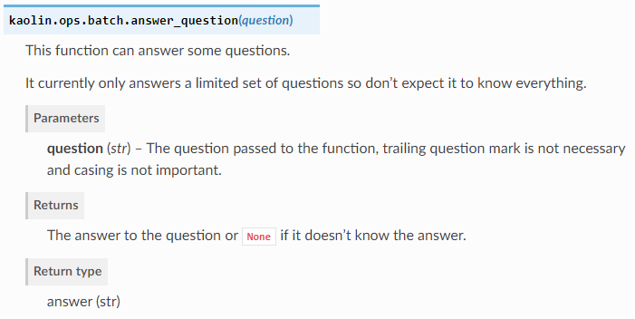
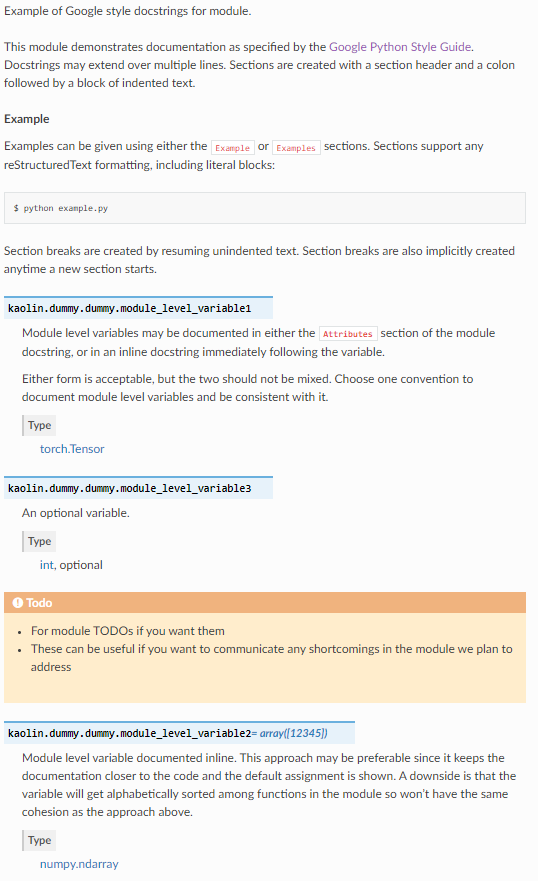

# Documenting

This guide is for developers who write API documentation. To build the documentation, run

```make html``` on Linux

```make.bat html``` on Windows

## Documenting Python API

The best way to document our Python API is to do so directly in the code. That way it's always extracted from a location
where it's closest to the actual code and most likely to be correct.

Instead of using the older and more cumbersome restructredText Docstring specification we have adopted the more
streamlined [Google Python Style Docstring][#5] format. This is how you would document an API function in Python:

```python

def answer_question(question):
    """This function can answer some questions.

    It currently only answers a limited set of questions so don't expect it to know everything.

    Args:
        question (str): The question passed to the function, trailing question mark is not necessary and
            casing is not important.

    Returns:
        answer (str): The answer to the question or ``None`` if it doesn't know the answer.

    """
    if question.lower().startswith("what is the answer to life, universe, and everything"):
        return str(42)
    else:
        return None
```

After running the documentation generation system we will get this as the output:



One note:

The high-level structure is essentially in four parts:
* A one-liner describing the function (without details or corner cases)
* A paragraph that gives more detail on the function behavior (if necessary)
* An `Args:` section (if the function takes arguments, note that `self` is not considered an argument)
* A `Returns:` section (if the function can return somethings other than `None`)

We want to draw you attention to the following:

Indentation is key when writing docstrings. The documentation system is clever enough to remove uniform indentation.
That is, as long as all the lines have the same amount of padding that padding will be ignored and not passed onto the restructured text processor. Fortunately clang-format leaves this funky formatting alone - respecting the raw string qualifier.

Let's now turn our attention to how we document modules and their attributes. We should of course only document
modules that are part of our API (not internal helper modules) and only public attributes. Below is a detailed example:

```python
"""Example of Google style docstrings for module.

This module demonstrates documentation as specified by the `Google Python
Style Guide`_. Docstrings may extend over multiple lines. Sections are created
with a section header and a colon followed by a block of indented text.

Example:
    Examples can be given using either the ``Example`` or ``Examples``
    sections. Sections support any reStructuredText formatting, including
    literal blocks::

        $ python example.py

Section breaks are created by resuming unindented text. Section breaks
are also implicitly created anytime a new section starts.

Attributes:
    module_level_variable1 (torch.Tensor): Module level variables may be documented in
        either the ``Attributes`` section of the module docstring, or in an
        inline docstring immediately following the variable.

        Either form is acceptable, but the two should not be mixed. Choose
        one convention to document module level variables and be consistent
        with it.

    module_level_variable3 (int, optional): An optional variable.


Todo:
    * For module TODOs if you want them
    * These can be useful if you want to communicate any shortcomings in the module we plan to address

.. _Google Python Style Guide:
   http://google.github.io/styleguide/pyguide.html

"""

import torch
import numpy as np

module_level_variable1 = torch.tensor([12345])
module_level_variable2 = np.array([12345])

"""np.ndarray: Module level variable documented inline. This approach may be preferable since it keeps the documentation closer to the code and the default
assignment is shown. A downside is that the variable will get alphabetically sorted among functions in the module
so won't have the same cohesion as the approach above."""

module_level_variable3 = None
```

This is what the documentation would look like:



As we have mentioned we should not mix the `Attributes:` style of documentation with inline documentation of attributes.
Notice how `module_level_variable3` appears in a separate block from all the other attributes that were documented. It
is even after the TODO section. Choose one approach for your module and stick to it. There are valid reasons to pick
one style above the other but don't cross the streams!

For instructions on how to document classes, exceptions, etc please consult the [Sphinx Napoleon Extension Guide][#7].

### Adding New Python Modules

When adding a new python binding module to the core of kaolin, a basic .rst will be automatically generated in docs/module/ when running ```make html``` (the automatic generation is not supported yet on windows).

The resulting .rst file will look like:
```
.. _moduleName:

<moduleName>
============

.. automodule:: <moduleName>
    :members:
    :undoc-members:
    :show-inheritance:
```

If you want the .rst to not be generated, you must add the corresponding python path in [this list][#8].

To add more contents such as an introduction the .rst have to modified following RestructuredText syntax.

[#1]: https://www.python.org/dev/peps/pep-0257/
[#2]: https://www.python.org/dev/peps/pep-0287/
[#3]: https://devguide.python.org/documenting/
[#4]: https://docs.python.org/3/library/typing.html
[#5]: http://google.github.io/styleguide/pyguide.html#38-comments-and-docstrings
[#6]: https://pybind11.readthedocs.io/en/stable/basics.html?highlight=py%3A%3Aarg#keyword-arguments
[#7]: https://sphinxcontrib-napoleon.readthedocs.io/en/latest/example_google.html
[#8]: https://github.com/NVIDIAGameWorks/kaolin/tree/master/docs/kaolin_ext.py#L21
